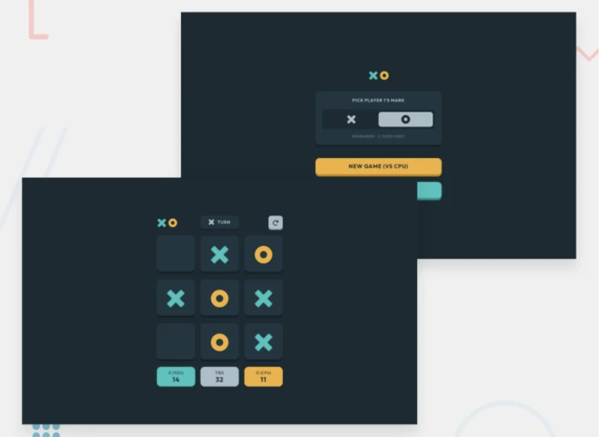

# Tic Tac Toe

This is a solution to the [Tic Tac Toe challenge on Frontend Mentor](https://www.frontendmentor.io/challenges/tic-tac-toe-game-Re7ZF_E2v).

## Overview

### The challenge

To create a browser based Tic Tac Toe game where users can:

- View the optimal layout for the game depending on their device's screen size
- See hover states for all interactive elements on the page
- Play the game either solo vs the computer or multiplayer against another person
- Save the game state automatically in the browser so that it’s preserved if the player refreshes their browser
- Play against an AI player that makes intelligent moves

### Screenshot

  

### Links

- The game is playable [here](https://tic-tac-toe.trentin.io)

## Built With

- [React](https://reactjs.org/)
- [Styled Components](https://styled-components.com/) - For styling
- Semantic HTML5 markup
- CSS custom properties
- Flexbox
- CSS Grid
- Mobile-first workflow
- AI player implemented using minimax algorithm
